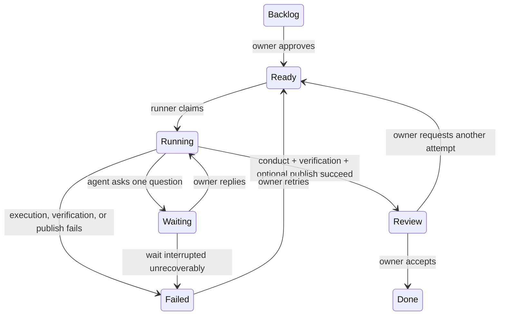

# Specification: Pi Conductor Vikunja Runner

**Status:** Draft for owner approval
**Version:** 0.1
**Date:** 2026-08-01
**Working name:** `pi-conductor-vikunja-runner`

## 1. Objective

Build a single-user, self-hosted daemon that turns approved Vikunja tasks into durable coding runs powered by `pi-conductor`.

The daemon runs on the existing Ubuntu VM, polls explicitly configured Vikunja projects, claims tasks placed in the **Ready** bucket, prepares an isolated Git worktree, runs `pi-conductor`, and communicates progress, questions, failures, and completion through Vikunja task comments and bucket transitions.

The daemon must preserve the existing `pi-conductor-analytics-plugin` telemetry contract. It must not require a GitHub App, GitHub Issues, a custom web UI, or the pi TUI.

Success means the owner can create a coding task, move it to **Ready**, leave the system unattended, later answer an agent question in Vikunja if necessary, and receive a reviewable branch or preserved local worktree with a clear final report.

## 2. Confirmed context and assumptions

These are the working assumptions for implementation. Change the spec before coding if any are incorrect.

1. The only human user is the owner.
2. Vikunja has one human account and one dedicated runner account.
3. One Vikunja project corresponds to one Git repository.
4. Numeric Vikunja project IDs are the automation keys. Project identifiers such as `PC` are display-only.
5. Every managed project has one manual Kanban view containing exactly these workflow buckets:
   - Backlog
   - Ready
   - Running
   - Waiting
   - Review
   - Failed
   - Done
6. **Backlog** is the view's default bucket and **Done** is its done bucket.
7. The runner is for coding work only in version 1.
8. Only one runner process and one conductor job run at a time in version 1.
9. The runner is deployed as a native `systemd` service under a dedicated, unprivileged Linux account. Container packaging is future work.
10. The Ubuntu VM can reach Vikunja, Git remotes, configured model providers, and the analytics endpoint.
11. Automatic merge and deployment are not allowed. Publishing a task branch is configurable per repository.
12. A normal user wait may keep the live process and conductor session open until the owner replies. Restarting during an unanswered dialog has an explicit fail-safe described below.

## 3. Tech stack and source contracts

Use:

- Node.js 22.19 or newer.
- TypeScript in strict mode with ESM modules.
- pnpm with a committed lockfile.
- SQLite in WAL mode for runner state.
- Native `fetch`/HTTP primitives behind a typed Vikunja adapter.
- Vitest for tests and Biome for formatting/linting.
- `systemd` for production process supervision on Ubuntu.

Implementation must target and pin compatible versions of these contracts:

- [`pi-conductor` 0.12.0](https://github.com/lynellf/pi-conductor/tree/38d1e2c370d6ae0f97ebb1980ac01d7aa6ea41d6): use the library API (`startRun`, `resumeRun`, `createProductionHost`, `subscribeToRecords`) rather than terminal scraping.
- [`pi-conductor-analytics-plugin` 0.2.0](https://github.com/lynellf/pi-conductor-analytics-plugin/tree/19d8a712668a1bbb77096558362b697f07a6c711): use `createAnalyticsReporter()` for programmatic delivery and backfill.
- Vikunja 2.4.x API: use the runner account's API token and the documented project, view, bucket, task, assignee, and comment APIs. The official API documents project-view and bucket operations at [Vikunja API documentation](https://try.vikunja.io/api/v1/docs).

The implementer must pin exact dependency versions in the lockfile and run the repository test suites or compatibility tests before upgrading any of these dependencies.

## 4. Scope

### 4.1 Included in version 1

- Poll a configured set of Vikunja projects.
- Validate project/view/bucket configuration before claiming work.
- Claim eligible tasks from **Ready** and move them to **Running**.
- Assign the runner account to claimed tasks when permissions allow.
- Maintain a durable task-to-job-to-conductor-run mapping in SQLite.
- Clone/fetch configured Git repositories and create one worktree and task branch per Vikunja task.
- Start and resume `pi-conductor` through its TypeScript library API.
- Present conductor `ask_user` dialogs through Vikunja comments.
- Accept explicit steering and abort commands through Vikunja comments.
- Run repository-specific verification commands after conductor completion.
- Optionally push a task branch; never merge it.
- Move tasks to **Waiting**, **Review**, or **Failed** with concise structured comments.
- Pass conductor records unchanged to the analytics reporter and invoke its backfill/shutdown lifecycle.
- Recover safely after process restarts without duplicating a task run.
- Provide structured logs, a health command, and a dry-run validation command.

### 4.2 Excluded from version 1

- A custom browser UI.
- GitHub Issues, GitHub Apps, pull-request creation, merging, or deployment.
- Vikunja webhooks or any inbound HTTP server.
- Multiple human users, multiple runner replicas, or distributed claiming.
- More than one active conductor job.
- Automatic creation or duplication of Vikunja projects and columns.
- Task attachments as model input.
- Arbitrary repository URLs, commands, model settings, or filesystem paths supplied through a task.
- Streaming raw model reasoning, tool output, or terminal output into Vikunja comments.

## 5. Workflow state machine



### 5.1 Bucket authority

- **Backlog:** ignored by the runner.
- **Ready:** the only bucket from which new work may be claimed.
- **Running:** a live runner job exists.
- **Waiting:** a live runner job is blocked on exactly one owner response.
- **Review:** the coding attempt completed successfully and is ready for human inspection.
- **Failed:** the attempt stopped without a reviewable successful result. Failure does not delete the branch, worktree, logs, or conductor records.
- **Done:** human-controlled terminal state. The runner must never move a task to **Done**.

### 5.2 Human overrides

- Moving a **Review** or **Failed** task to **Ready** creates a new attempt for the same task and reuses its preserved task branch by default.
- Moving an active **Running** or **Waiting** task to **Failed** requests an abort and preserves the human-selected bucket.
- Other manual moves of an active task must not be silently overwritten. The runner aborts, comments with `MANUAL_STATE_OVERRIDE`, and records the observed state.

## 6. Eligibility, ordering, and claiming

A task is eligible only when all of the following are true:

1. Its numeric project ID exists in runner configuration.
2. It appears in that project's configured **Ready** bucket.
3. It is not marked done.
4. It has no active job in the local job store.
5. Global and per-project concurrency limits permit another job.

Eligible tasks are ordered by:

1. Vikunja priority, highest first.
2. Kanban position, left-to-right/top-to-bottom order returned by Vikunja.
3. Numeric task ID, lowest first, as a deterministic tie-breaker.

Version 1 relies on a single process and a local SQLite transaction for claiming. The service must be configured with `replicas = 1`. Distributed compare-and-swap claiming is explicitly out of scope.

Claim sequence:

1. Read the task and verify it is still in **Ready**.
2. In a short immediate SQLite transaction, insert a unique `claiming` job row and commit. Never hold a database transaction open across a network call.
3. Re-read the task and verify it remains in **Ready**. If not, mark the local claim as conflicted and stop.
4. Move the task to **Running**.
5. Assign the runner user if not already assigned.
6. Post the start comment with job ID and branch name.
7. In a second short transaction, record the observed remote IDs and transition the local job from `claiming` to `running`.

If any remote operation fails, compensate where safe, retain the job record, and surface one actionable failure comment. Retrying the same operation must not create duplicate jobs or duplicate milestone comments.

## 7. Configuration contract

Configuration is YAML, versioned, validated at startup, and treated as immutable until restart.

```yaml
version: 1

vikunja:
  base_url: "http://100.80.73.65:30111"
  token_file: "/run/credentials/vikunja_api_token"
  owner_user_id: 1
  runner_user_id: 2
  poll_interval_seconds: 30
  waiting_poll_interval_seconds: 15
  request_timeout_seconds: 10
  allow_insecure_http: true

runner:
  data_dir: "/var/lib/pi-conductor-vikunja-runner"
  global_concurrency: 1
  agent_dir: "/var/lib/pi-conductor-vikunja-runner/pi-agent"
  analytics_config_path: "/run/credentials/conductor-analytics.json"
  max_comment_chars: 12000

projects:
  "42":
    display_identifier: "PC"
    kanban_view_id: 8
    repository: "git@github.com:lynellf/pi-conductor.git"
    default_branch: "main"
    conductor_manifest: ".pi/conductor.yaml"
    publish:
      mode: "push_branch" # "local" or "push_branch"
      remote: "origin"
    verify_commands:
      - ["pnpm", "typecheck"]
      - ["pnpm", "test"]
      - ["pnpm", "lint"]
```

Rules:

- Project keys, view IDs, runner user IDs, and task IDs are numeric branded IDs internally.
- Only `owner_user_id` may answer questions or issue `/pi` control commands.
- Repository URL, default branch, manifest path, verification commands, and publish mode come only from trusted configuration.
- `display_identifier` is informational and must never select a repository.
- `global_concurrency` must equal `1` in version 1.
- Plain HTTP is rejected unless `allow_insecure_http` is explicitly true and the host is loopback, RFC1918, or the Tailscale CGNAT range.
- Secret values are read from protected files, never embedded in YAML.
- Unknown fields are rejected to catch misspellings.

## 8. Repository and worktree contract

The runner maintains one persistent clone per configured project and one worktree per task and project. Including the project identity prevents a task moved between configured projects from reusing a checkout for the wrong repository:

```text
<data_dir>/
  state.sqlite
  conductor-runs/
  repositories/<project_id>/repo/
  jobs/<task_id>/projects/<project_id>/worktree/
  jobs/<task_id>/metadata.json
```

For a first attempt:

1. Clone or fetch the configured repository.
2. Resolve the configured remote default branch without taking values from task content.
3. Create `pi/vikunja-<task-id>-<slug>` from the current remote default branch.
4. Create the task worktree on that branch.
5. Verify the real path remains under `<data_dir>/jobs/<task_id>`.

For a retry from **Review** or **Failed**, reuse the existing task branch and worktree only when the project and configured repository are unchanged, unless the owner explicitly requests a clean retry in configuration or a future command.

All Git and verification processes must be spawned with argument arrays and an explicit working directory. Never interpolate task content into a shell command. Never force-push, delete a remote branch, merge, rebase a shared branch, or discard uncommitted files automatically.

## 9. Prompt construction

The initial conductor goal is deterministic Markdown containing:

- Vikunja task ID and human reference (`PC-12` when available).
- Task title.
- Task description.
- Relevant human comments in chronological order.
- Repository name, task branch, and default branch.
- Explicit instruction to work only in the supplied worktree.
- Explicit instruction to use `ask_user` for any decision requiring the owner.
- Explicit instruction to run the configured project checks and leave a reviewable, clean worktree.
- Explicit prohibition on merging, deploying, force-pushing, modifying runner configuration, or reading runner secrets.

Task and comment text is model input, not trusted configuration. Bound input size and note truncation in the prompt. Do not include comments authored by the runner unless they contain owner-visible context needed for a retry.

## 10. Pi Conductor integration

Use the library integration rather than the TUI, RPC terminal parsing, or the standalone CLI.

At daemon startup:

```ts
const authStorage = AuthStorage.create();
const modelRegistry = ModelRegistry.create(authStorage);
```

For each job, create a production host with:

- `cwd` equal to the task worktree.
- The runner's shared `ModelRegistry`.
- A Vikunja-backed `ExtensionUIContext`.
- The configured isolated `agentDir`.
- `sessionDir` set to `<data_dir>/conductor-runs/<run_id>/sessions` so role transcripts never appear in the repository worktree.

Start a first attempt with `startRun()` and pass `<data_dir>/conductor-runs` as `baseDir`. Persist `handle.runId` before awaiting `handle.completion()`.

Use `resumeRun()` only for a recorded nonterminal run after a process crash. Let pi-conductor perform its documented crashed-session reconciliation. A task with a terminal conductor run gets a new conductor run ID on its next attempt.

Interpret completion as follows:

- `exitReason === "done"`: continue to deterministic verification and optional publishing.
- `exitReason === "session_failed"`: move to **Failed**.
- `exitReason === "aborted"`: move to **Failed** unless a human override already selected another bucket.
- A thrown setup/runtime exception: move to **Failed** with a stable error code.

The repository's `.pi/conductor.yaml` must explicitly list every tool required by each role. The runner must not patch role tool allowlists at runtime.

## 11. Human interaction through Vikunja

### 11.1 `ask_user` adapter

Implement `ExtensionUIContext.input`, `.confirm`, and `.select` as durable Vikunja interactions:

1. Generate a question ID.
2. Persist its type, text, choices, task ID, and comment watermark in SQLite.
3. Post one **Question** comment as the runner account.
4. Move the task from **Running** to **Waiting**.
5. Poll comments newer than the question comment.
6. Accept the first valid non-runner response.
7. Persist the answer before resolving the waiting promise.
8. Move the task to **Running**.
9. Return the answer to the original `ask_user` tool call.

Question types:

- `input`: any non-empty owner comment.
- `confirm`: case-insensitive `yes`, `y`, `no`, or `n`; otherwise post one correction and keep waiting.
- `select`: exact option text or a one-based option number; otherwise post one correction and keep waiting.

Honor the provided `AbortSignal`. An abort must reject the pending dialog, record the reason, and stop polling.

Normal waits may remain open indefinitely. If the daemon exits while a dialog is unresolved, it cannot safely reconstruct that exact in-memory role tool call. On restart, move the task to **Failed** with error code `WAIT_INTERRUPTED`, preserve the saved question and answer if present, and instruct the owner to move the task back to **Ready**. Never fabricate an answer.

### 11.2 Comment commands

Only comments authored by the human account may control a run.

- `/pi steer <message>` while **Running** calls `RunHandle.steer(message)` and posts a short acknowledgement.
- `/pi abort [reason]` while **Running** or **Waiting** calls `RunHandle.abort(reason)`.
- Plain comments while **Waiting** are candidate answers to the active question.
- Other plain comments while **Running** are retained for the next attempt but are not injected into a live run implicitly.

Unknown `/pi` commands receive one help response and do not change job state.

### 11.3 Comment output policy

Post comments only for durable milestones:

- Claimed/start.
- User question or invalid-answer correction.
- Steering/abort acknowledgement.
- Review-ready completion.
- Failure.

Do not post chain-of-thought, hidden reasoning, secrets, raw tool streams, or full session transcripts. Truncate oversized summaries with a pointer to the local run ID. Every runner comment includes a stable machine marker and idempotency key so retries update or suppress duplicates.

## 12. Verification and publishing

After conductor exits with `done`:

1. Capture `handle.latestResponse()` and `handle.runStats()`.
2. Run each configured verification command sequentially in the task worktree.
3. Record command, exit code, duration, and a bounded tail of output.
4. Verify the worktree is clean or clearly report preserved uncommitted changes.
5. If `publish.mode` is `push_branch`, push the task branch using a normal non-force push.
6. Post the review summary and move the task to **Review**.

Any verification or push failure moves the task to **Failed** and preserves all local state. The runner must not claim that work is review-ready when required checks or publishing failed.

The review comment includes:

- Task branch.
- Commit range or latest commit.
- Whether the branch was pushed and to which configured remote.
- Verification results.
- Conductor run ID and attempt number.
- A bounded final response/summary.
- Clear instructions: move to **Done** to accept, or comment with feedback and move to **Ready** for another attempt.

## 13. Telemetry contract

Create one analytics reporter for the daemon's central conductor log directory:

```ts
const reporter = createAnalyticsReporter({
  cwd: dataDir,
  runsDir: join(dataDir, "conductor-runs"),
  configPath: analyticsConfigPath,
  source: "vikunja-runner:conductor:record",
});

await reporter.backfill();
const unsubscribe = subscribeToRecords((record) => reporter.enqueue(record));
```

Requirements:

- Enqueue each `PersistedRecord` unchanged. Do not rename fields, wrap individual records, or synthesize conductor records.
- Keep analytics best-effort and non-blocking. Analytics failure must not fail or pause coding work.
- Log reporter statistics and queue-overflow diagnostics without logging authorization headers.
- Use the reporter's JSONL backfill and watermark behavior on every daemon startup.
- On graceful shutdown: stop accepting new jobs, abort or drain the active run according to the shutdown timeout, unsubscribe, and call `reporter.shutdown()`.
- At-least-once delivery means duplicates are allowed. Downstream analytics consumers remain responsible for deduplication.
- A compatibility test must prove that lifecycle, transition, checkpoint, and `file_mutation` records reach a mock analytics endpoint.

## 14. Persistence and idempotency

Use SQLite in WAL mode with parameterized queries. Schema migrations are versioned and applied transactionally.

Minimum durable entities:

- `jobs`: task ID, project ID, attempt, state, branch, worktree, conductor run ID, timestamps, and stable terminal error code.
- `questions`: question ID, job ID, kind, prompt, options, Vikunja comment ID, response comment ID, answer, and resolution state.
- `comment_watermarks`: last processed comment ID per task.
- `milestones`: job ID, milestone type, idempotency key, Vikunja comment ID, and delivery state.
- `schema_migrations`: applied migration versions.

There may be at most one active job per task and at most one globally active job in version 1. Enforce both invariants in the database, not only in memory.

Vikunja calls are not transactional with SQLite. Model every remote mutation as an idempotent operation with a recorded intent and observed result. On startup, reconcile local state with the current bucket before starting or resuming work.

## 15. Error model

Internal errors use one discriminated shape:

```ts
interface RunnerError {
  code:
    | "CONFIG_INVALID"
    | "VIKUNJA_UNAVAILABLE"
    | "PROJECT_LAYOUT_INVALID"
    | "CLAIM_CONFLICT"
    | "REPOSITORY_PREPARE_FAILED"
    | "CONDUCTOR_START_FAILED"
    | "CONDUCTOR_SESSION_FAILED"
    | "WAIT_INTERRUPTED"
    | "VERIFY_FAILED"
    | "PUBLISH_FAILED"
    | "MANUAL_STATE_OVERRIDE";
  message: string;
  retryable: boolean;
  cause?: unknown;
}
```

User-facing comments contain the stable code, a concise explanation, preserved artifacts, and the next action. They must not contain stack traces, tokens, authorization headers, full environment dumps, or model-provider credentials.

Transient Vikunja reads retry with bounded exponential backoff and jitter. Do not retry validation, authorization, or semantic `4xx` failures indefinitely.

## 16. Security requirements

- Run under a dedicated Linux user with no sudo, no Docker socket, and no write access outside the configured data directory and repository worktrees.
- Use a dedicated Vikunja API token from the runner account. The account receives write access only to managed coding projects.
- Load the Vikunja token, model credentials, analytics token/config, and Git private keys from protected files or the service credential mechanism. File permissions must be `0600` or stricter.
- Redact secrets from structured logs and error comments.
- Validate every Vikunja response before using it. Treat task content and comments as untrusted model input.
- Resolve and verify filesystem paths before file or process operations. Reject paths escaping the configured data directory or worktree.
- Spawn commands with argument arrays. Never evaluate task text as shell, JavaScript, templates, repository URLs, paths, or configuration.
- Permit only configured repositories, branches, manifests, verification commands, and remotes.
- Do not expose an inbound network listener in version 1.
- Prefer HTTPS. Plain HTTP requires the explicit private-network override described in configuration.
- Run `pnpm audit --prod` before releases. Critical or reachable high-severity vulnerabilities block deployment.
- Never commit runtime credentials, `.env` files, private keys, SQLite state, worktrees, or conductor session logs.

## 17. Module interfaces

Define contracts before adapters so business logic can be tested without Vikunja, Git, or an LLM:

```ts
interface VikunjaGateway {
  validateProjectLayout(project: ProjectConfig): Promise<ProjectLayout>;
  listReadyTasks(layout: ProjectLayout): Promise<readonly CodingTask[]>;
  getTask(taskId: TaskId): Promise<CodingTask>;
  moveTask(taskId: TaskId, bucketId: BucketId): Promise<void>;
  assignRunner(taskId: TaskId): Promise<void>;
  listComments(taskId: TaskId, after: CommentId | null): Promise<readonly TaskComment[]>;
  postComment(taskId: TaskId, body: string): Promise<CommentId>;
}

interface ConductorGateway {
  start(job: Job, goal: string, ui: RunnerUiContext): Promise<ConductorHandle>;
  resume(job: Job, ui: RunnerUiContext): Promise<ConductorHandle>;
}

interface RepositoryManager {
  prepare(job: Job, project: ProjectConfig): Promise<PreparedWorktree>;
  verify(worktree: PreparedWorktree, commands: readonly CommandSpec[]): Promise<Verification>;
  publish(worktree: PreparedWorktree, publish: PublishConfig): Promise<PublishResult>;
}

interface JobStore {
  tryClaim(task: CodingTask): Promise<Job | null>;
  recordRunId(jobId: JobId, runId: string): Promise<void>;
  transition(jobId: JobId, transition: JobTransition): Promise<Job>;
  recoverableJobs(): Promise<readonly Job[]>;
}
```

Third-party response validation belongs inside adapters. Internal services consume validated domain types. Public configuration and persisted records are versioned additively.

The Vikunja adapter must follow pagination metadata/headers until all requested pages are consumed. It may treat an endpoint as unpaginated only when that behavior is part of Vikunja's documented contract. Ordering must not depend on HTTP response arrival timing.

## 18. Project structure

```text
src/
  config/             YAML loading, schemas, secret-file resolution
  domain/             IDs, job states, errors, transitions
  vikunja/            HTTP adapter and response schemas
  conductor/          host factory, run adapter, UI adapter, telemetry bridge
  repositories/       clone, fetch, worktree, verification, publishing
  persistence/        SQLite connection, migrations, repositories
  jobs/               polling, claiming, orchestration, reconciliation
  reporting/          milestone comments and redaction
  cli/                run, validate, health, once commands
  main.ts             composition root and signal handling
tests/
  unit/
  integration/
  fixtures/
docs/
  operations.md
  task-authoring.md
migrations/
```

Use TypeScript strict mode, explicit return types at module boundaries, discriminated unions for states/errors, branded IDs, dependency injection at external boundaries, and no default exports.

## 19. Commands

The resulting project must expose these commands:

```bash
pnpm install --frozen-lockfile
pnpm build
pnpm typecheck
pnpm lint
pnpm lint:fix
pnpm test
pnpm test:coverage
pnpm audit --prod
pnpm dev -- --config ./config.example.yaml
pnpm start -- --config /etc/pi-conductor-vikunja-runner/config.yaml
pnpm runner:validate -- --config /etc/pi-conductor-vikunja-runner/config.yaml
pnpm runner:once -- --config /etc/pi-conductor-vikunja-runner/config.yaml
pnpm runner:health -- --config /etc/pi-conductor-vikunja-runner/config.yaml
```

`runner:validate` performs read-only configuration, credentials, Vikunja layout, repository, manifest, model-provider, and analytics checks. `runner:once` runs one polling/claim cycle and then waits for any claimed job to terminate. `runner:health` verifies configuration, database access, Vikunja connectivity, and daemon heartbeat without starting work.

## 20. Testing strategy

Use Vitest with fake clocks and dependency-injected adapters. CI must not require a real model-provider key.

### Unit tests

- Configuration validation and secret redaction.
- Bucket layout validation, including missing and duplicate names.
- Task ordering and eligibility.
- Every legal and illegal job-state transition.
- Comment command parsing and author checks.
- `input`, `confirm`, and `select` answer validation.
- Idempotency keys and duplicate-poll behavior.
- Path confinement, branch-name sanitization, and command argument handling.
- Error mapping and retry classification.

### Integration tests

- Mock Vikunja HTTP server covering pagination, auth errors, timeouts, bucket moves, comments, and malformed responses.
- Temporary Git repository covering first attempt, retry, dirty worktree, non-fast-forward push rejection, and preserved failure artifacts.
- SQLite restart/reconciliation tests.
- `pi-conductor` with its deterministic stub provider: start, completion, session failure, abort, and crash resume.
- Vikunja-backed `ask_user`: Running → Waiting → Running with input/confirm/select.
- Analytics mock endpoint: live delivery, outage, shutdown, restart backfill, duplicates, and `file_mutation` pass-through.

### End-to-end smoke test

Against a disposable Vikunja project and local bare Git remote:

1. Create a task in **Ready**.
2. Runner claims it once.
3. Stub conductor asks a question.
4. Owner/test client replies in Vikunja.
5. Run resumes and completes.
6. Verification succeeds and branch publishes.
7. Task moves to **Review** with exactly one final comment.
8. Expected telemetry records arrive.

Target at least 85% branch and line coverage for domain, claiming, reconciliation, and interaction modules. External adapters may use contract-focused coverage rather than a blanket percentage.

## 21. Operational behavior

- Poll every 30 seconds with small jitter; do not poll faster after errors.
- Use a separate 15-second loop only while waiting for an owner answer.
- Emit structured JSON logs to stdout/stderr for journald.
- Include job ID, Vikunja task ID, project ID, attempt, and conductor run ID in log context.
- Maintain a daemon heartbeat in SQLite for `runner:health`.
- On `SIGTERM`/`SIGINT`, stop claiming tasks, request graceful conductor abort, flush durable state, then shut down analytics within a bounded timeout.
- A second termination signal may exit immediately after logging that recovery will occur on restart.
- Preserve state indefinitely by default. Log/session pruning is a separate, owner-approved feature.

## 22. Boundaries

### Always do

- Validate configuration and all external API responses.
- Keep one numeric project-ID-to-repository mapping.
- Persist state before announcing remote state transitions where possible.
- Preserve branches, worktrees, conductor logs, and telemetry logs on failure.
- Run all required verification commands before **Review**.
- Maintain exact analytics-record pass-through.
- Run build, typecheck, lint, tests, and production dependency audit before release.

### Ask the owner first

- Add a new external service or inbound endpoint.
- Enable branch pushing for a repository currently configured as local-only.
- Create pull requests, merge, deploy, or delete branches/worktrees/logs.
- Increase concurrency or add another runner replica.
- Add task attachments or other new model-input sources.
- Change the database schema outside an approved migration.
- Modify `pi-conductor`, its analytics plugin, or repository manifests to accommodate the runner.

### Never do

- Use task content to choose a repository, path, command, remote, branch base, model credential, or analytics endpoint.
- Auto-answer a conductor question.
- Move a task to **Done**.
- Force-push, merge, deploy, or discard user work.
- Log, comment, or commit secrets or full environment dumps.
- Treat analytics delivery failure as a coding-job failure.
- Run more than one daemon replica under the version 1 claim model.

## 23. Acceptance criteria

The version 1 implementation is complete when all of the following are demonstrated:

1. `runner:validate` accepts a correct configuration and rejects missing/duplicate workflow buckets without changing Vikunja.
2. A configured **Ready** task is claimed exactly once and moves to **Running**.
3. Tasks in unconfigured projects or any other bucket are ignored.
4. The numeric project ID, not its name or identifier, selects the repository.
5. The runner creates a confined worktree and deterministic task branch from the configured default branch.
6. The task-to-job-to-run mapping survives a daemon restart.
7. `pi-conductor` is invoked through its library API with the repository's manifest and worktree as `cwd`.
8. A conductor `ask_user` call moves the task to **Waiting**, posts one question, accepts one valid owner reply, moves back to **Running**, and returns that reply to the same live tool call.
9. Invalid confirm/select replies do not resume the run and receive a bounded correction.
10. Restart during an unresolved question fails safely with `WAIT_INTERRUPTED`; no answer is invented or lost silently.
11. `/pi steer` reaches the live `RunHandle`; `/pi abort` terminates the run.
12. Successful conductor completion does not reach **Review** until every configured verification command passes.
13. Push mode performs only a normal task-branch push; local mode performs no remote mutation.
14. A successful attempt moves to **Review** with branch, commit, verification, attempt, and run details.
15. Failure moves to **Failed** once, includes a stable error code, and preserves artifacts.
16. The runner never moves a task to **Done**, merges, deploys, force-pushes, or deletes preserved work.
17. Repeated polls and process restarts do not duplicate active jobs or milestone comments.
18. Conductor persisted records, including `file_mutation`, reach the analytics endpoint unchanged during normal operation.
19. Analytics outage does not fail the coding run, and startup backfill retries unsent records with the plugin's at-least-once semantics.
20. No secrets appear in logs, task comments, fixtures, committed configuration, or error messages.
21. Build, typecheck, lint, unit/integration tests, coverage threshold, and production dependency audit pass.
22. The service runs under `systemd` as an unprivileged user and recovers a crashed non-waiting conductor run with `resumeRun()`.

## 24. Open decisions before production deployment

The implementation may be scaffolded with the recommended defaults, but these must be confirmed before live use:

1. **Repository/package name:** recommended `pi-conductor-vikunja-runner`.
2. **Publishing default:** recommended `push_branch` for repositories with a dedicated scoped SSH key; otherwise `local`.
3. **Model authentication:** decide whether the service account uses provider environment variables or an isolated pi `auth.json` under `runner.agent_dir`.
4. **Per-repository verification:** define the exact required commands for each managed repository.
5. **Git author identity:** define the runner commit name/email and whether conductor roles are required to commit before completion.
6. **HTTP exception:** confirm that Vikunja remains on its Tailscale HTTP address and that `allow_insecure_http: true` is acceptable for that encrypted network path.

## 25. Handoff instruction

Before implementation, the owner reviews and approves this specification or edits its assumptions/open decisions. After approval, create a dependency-ordered implementation plan and task list. Implement incrementally with tests first for state transitions, claiming/idempotency, the Vikunja `ask_user` bridge, restart recovery, and telemetry compatibility.
